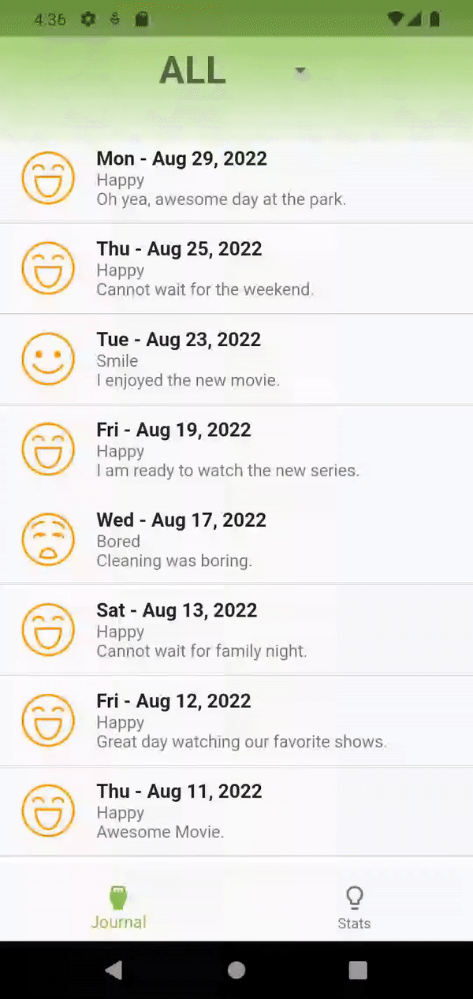

# Journal State Management - No Packages
Journal - State Management by using InheritedWidget.
State Management by using built-in Flutter classes.

## Video Tutorial
[YouTube Video](https://youtu.be/02dytMCWKgM)

[Blog](https://jedipixels.dev/flutter-state-management-using-inheritedwidget-for-journal-app)



## What is covered
In this project, you are going to take a look at:
- How to use InheritedWidget to pass data from a parent (ancestor) widget to child (descendant) widgets in the widget tree
- State Management with build in classes, no packages

## The Problem:
- Journal app has a mood selector value to be available to all pages.
- All pages need to read selected mood from the parent page.

## The Solution:
- Use the InheritedWidget to allow child pages (widgets) to access the parent page selected mood by going up the widget tree.


## InheritedWidget
The `InheritedWidget` is immutable and allows child widgets to access data (state) above in the widget tree
1. Create a class that extends `InheritedWidget`
2. Add fields to contain data
3. Add the `of()` method to access the InheritedWidget from child widgets
4. Add the `updateShouldNotify()` method to notify (via Flutter framework) widgets to rebuild if the data changed

```dart
class AppState extends InheritedWidget {
  final Moods moods;

  const AppState({
    Key? key,
    required this.moods,
    required Widget child,
  })  : super(key: key, child: child);

  static AppState? of(BuildContext context) {
    return context.dependOnInheritedWidgetOfExactType<AppState>();
  }

  @override
  bool updateShouldNotify(AppState oldWidget) {
    return moods != oldWidget.moods;
  }
}
```

## How it Works
- InheritedWidget – The InheritedWidget is great to pass data from an ancestor widget to descendent widget. The InheritedWidget is immutable and the data (attributes) are final (cannot change) and the Flutter framework rebuilds the InheritedWidget to refresh with new data.

## [License: MIT](LICENSE.md)
